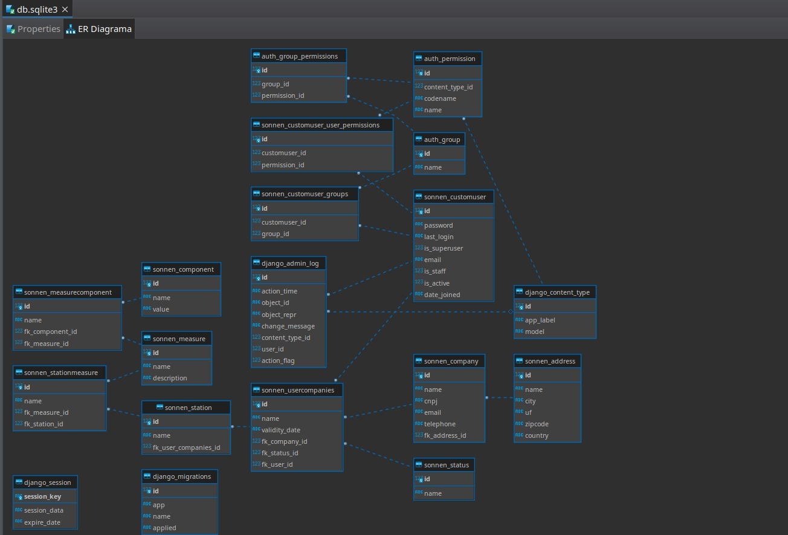

# Documentação API Sonnen 
##  Criando um repositório no GitHub para desenvolvimento colaborativo.

Nele, todas as informações relacionadas ao nosso projeto serão armazenadas. Além disso, implementamos ramificações (branches) para controlar as versões e atualizações do projeto sem afetar nosso código principal, denominado main.
Nosso repositório está organizado da seguinte forma:

- **Main:** Aqui está o código principal, que contém apenas atualizações revisadas e prontas para serem transferidas. Este é o código apresentado ao nosso cliente, portanto, qualquer erro aqui afetará diretamente o projeto final.

- **Dev:** Esta é a nossa branch de desenvolvimento. Aqui serão feitas as atualizações que precisam ser revisadas antes de serem transferidas para o código principal.

- **XXXXXXEstavel:** Essas são ramificações locais de desenvolvimento dos colaboradores. Cada desenvolvedor possui sua própria ramificação, onde serão feitas todas as alterações no código.

## Criando a API *(Application Programming Interface)*
A API é um conjunto de códigos, regras, protocolos e opções que podem ser acessados e utilizados por outros softwares, podem ser utilizados para acessar funcionalidades e recursos de um sistema, sem a preocupação sobre sua construção e funcionalidades detalhadas.
Um bom exemplo é a interação de um desenvolvedor com uma biblioteca ou framework de programação, eles na realidade está interagindo com a API, que está definindo quais são as funções diponíveis para uso, como elas devem ser chamadas e que quais são as respostas esperadas.

### WebAPIs: 

Web APIs, por outro lado, são um tipo específico de API que operam sobre os protocolos da web, principalmente HTTP. Elas permitem a interação entre diferentes sistemas e serviços através da internet. Web APIs são amplamente utilizadas para integrar aplicações web com serviços externos e para permitir que programas se comuniquem uns com os outros sobre a web.
Web APIs são fundamentais no desenvolvimento de serviços baseados na nuvem, aplicativos móveis, e na integração de sistemas de grande escala. Elas permitem funcionalidades como:
 1. **Integração com Redes Sociais:** Permitindo que aplicativos ofereçam funcionalidades que dependem de informações de perfis sociais, como login através de redes sociais.
 2. **Serviços de Pagamento:** Integrando plataformas de e-commerce com serviços de pagamento online como PayPal, Stripe ou sistemas de pagamento bancário.
 3. **Dados Geográficos:** Aplicativos que utilizam localização para fornecer serviços baseados na posição atual do usuário, integrando-se com APIs de mapas como Google Maps ou Apple Maps.

### Rest APIs *(Representational State Transfer APIs)*
São um estilo de arquitetura de software que utilizam o protocolo HTTP para comunicação entre sistemas, amplamente adotadas para a criação de web services. 
Uso de Métodos HTTP Padrão: REST APIs usam métodos padrão HTTP como GET, POST, PUT, DELETE e PATCH para realizar operações. Cada método indica a ação que o servidor deve executar:
- **GET** para recuperar dados,
- **POST** para criar um novo recurso,
- **PUT** para atualizar um recurso existente,
- **DELETE** para remover um recurso,
- **PATCH** para modificar um recurso existente.

Os desenvolvedores têm a liberdade de escolher o formato de dados que mais se adequa às suas necessidades, como JSON, XML, YAML, entre outros. Isso torna as APIs REST fáceis de entender e implementar. Como as REST APIs utilizam o protocolo HTTP, elas podem ser utilizadas com qualquer linguagem de programação ou plataforma que suporte HTTP, facilitando assim a integração com sistemas existentes. Além disso, devido à sua natureza stateless e ao uso de cache, as REST APIs proporcionam maior escalabilidade e eficiência no processamento de solicitações.

### JSON *(JavaScript Object Notation)*

JSON (JavaScript Object Notation) é um formato de notação de objetos amplamente utilizado para a transmissão e armazenamento de dados entre sistemas computacionais. Devido à sua simplicidade e capacidade de ser interpretado facilmente por humanos e máquinas, JSON tornou-se uma escolha popular em diversas linguagens de programação.

O formato JSON é baseado em uma estrutura de pares chave-valor, que permite representar dados de forma hierárquica e organizada. Esses pares chave-valor são encapsulados por chaves {} para objetos e colchetes [] para arrays, facilitando a modularização e recuperação de informações complexas de maneira eficiente.

Uma das características fundamentais do JSON é que ele não permite o uso de funções ou comentários dentro do texto, visando manter o formato minimalista e focado exclusivamente em dados. Além disso, tanto as chaves quanto os valores de string devem ser encapsulados em aspas duplas, o que diferencia JSON de alguns outros formatos que permitem aspas simples.

Essas regras fazem do JSON um formato extremamente robusto, portátil e fácil de integrar, sendo amplamente utilizado em APIs web, configurações de softwares, comunicação entre serviços de microserviços e muitos outros contextos onde a troca de dados de forma clara e eficaz é crucial.

# Diagrama de funcionamento

### Sonnen customuser :
Essa tabela representa os usúarios do sistemas, que podem possuir diferentes tipos de permissões e participar de diferentes grupos.

**Exemplo:** Pode-se ter úsuario para diferentes tipos de clientes, um úsuario para os técnicos-auxiliares e todos esses usúarios possuem diferente tipos de permissões dentro da API.

### Sonnen company 
Armazena informações sobre empresas associadas aos usuários, um usuário pode ter mais de uma empresa.

### Sonnen address

### Sonnen measure

### Sonnen component